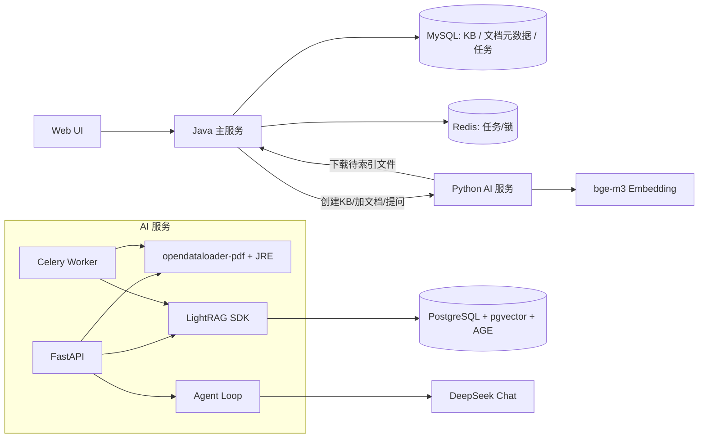
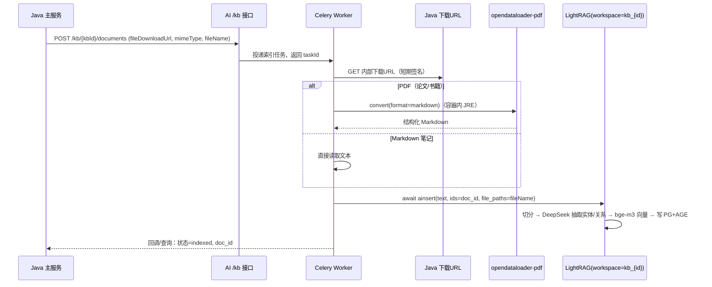
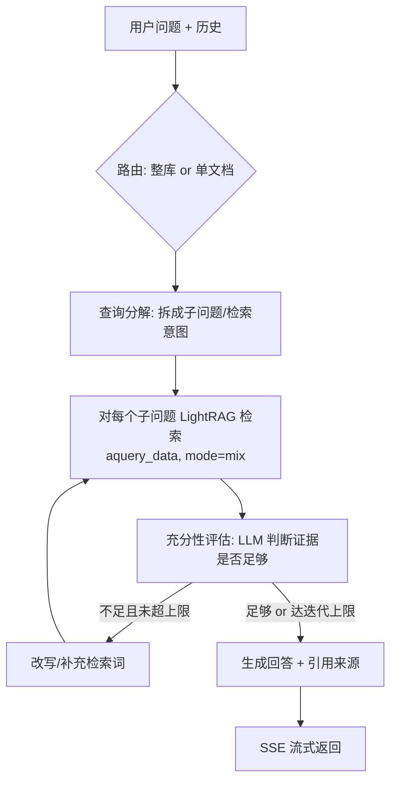

# Agentic Graph RAG 知识库设计

> 状态：P0-P8 已实现，P9 本地自动化验证完成
> 作者：—
> 关联：替换 `docs/overview-design.md` § 5.2 现有 pgvector chunk RAG 管线

---

## 1. 解决什么问题 / 实现什么功能

在现有「网盘文件列表 + 语义搜索」之上，引入 **Agentic Graph RAG 知识库**，提供两类问答能力：

1. **整库知识问答（功能1）**：用户创建知识库（KB），把多篇文档加入后，LLM 基于**整个知识库**与用户问答。
2. **单文档问答（功能2）**：针对知识库内**某一篇 PDF**（论文 / 书籍）与用户问答。

初期文档格式只支持两种：

- **PDF**：多为论文，也包含书籍，使用 `opendataloader-pdf` 解析为结构化 Markdown。
- **Markdown**：用户笔记，直接入库。

Graph RAG 使用 `LightRAG`（`lightrag-hku`）：抽取实体 / 关系构建知识图谱 + 向量检索，支持**增量更新**（新文档直接 `ainsert`，无需重建）。在其检索能力之上，自研 **agent loop** 提升复杂问题的回答质量。

---

## 2. 为什么选这个方案（关键决策）

| # | 决策 | 取舍说明 |
|---|------|---------|
| 1 | **统一为 LightRAG**，替换现有 pgvector chunk RAG（`embedding_service` / `search_service` / `chat_service` / `vector_doc`） | 运维与代码一元化；现有自研 chunk RAG 与 Graph RAG 能力重叠，避免双轨维护。代价：一次性迁移成本。 |
| 2 | **存储统一到 PostgreSQL + Apache AGE**：KV / 向量 / 图 / doc-status 四类存储全部落 PG | 不新增数据库；图用 AGE（Cypher）。代价：需替换 PG 镜像（见 §6）。 |
| 3 | **共享 KB + 文档来源过滤** 实现单文档 QA | 不为每篇文档单独建图，建图成本低。代价：LightRAG 查询无原生 doc 过滤，需在 agent loop 内**召回后过滤**（见 §4.4）。 |
| 4 | **一开始即实现完整 agent loop**（查询分解 → 反复检索 → 充分性评估 → 再检索 → 引用回答） | 复杂论文 / 整库问题效果更好。代价：LLM 调用多、延迟与成本高，需设迭代上限与超时。 |
| 5 | LLM 初期只接 **DeepSeek**（`deepseek-chat`）；Embedding 用**本地 bge-m3**（GPU 优先，CPU 可降级） | DeepSeek 无官方 embedding API，故 embedding 与 chat 解耦。bge-m3 中文友好、免费、可控成本。 |
| 6 | PDF 解析用 `opendataloader-pdf`，**AI 容器内置 JRE** | 该 SDK 实为 Java JAR 包装，需 `java` 命令；内置最简单（代价：镜像变大）。 |

### 为什么是 LightRAG 而非自研 / GraphRAG（微软）

- 增量更新原生支持（`ainsert` / `adelete_by_doc_id`），契合网盘「随时加文档」场景。
- 存储可插拔，能直接复用 PostgreSQL。
- 暴露 `aquery_data()`（原始检索）/ `aquery_llm()`，便于在其上自建 agent loop，不被一次性回答绑死。

---

## 3. 总体架构



**职责边界**：

- **Java 主服务**：知识库与文档的业务实体管理（归属、权限、状态），触发解析/索引任务，代理问答请求（SSE 透传）。不直接触碰向量/图存储。
- **Python AI 服务**：PDF 解析、LightRAG 索引、agent loop 问答。每个 KB 对应一个 LightRAG **workspace**（PG 内逻辑隔离）。
- **PostgreSQL + AGE**：LightRAG 全部四类存储后端。
- **DeepSeek**：LightRAG 实体抽取 + agent loop 推理与生成。
- **bge-m3**：向量化。

---

## 4. 实现原理

### 4.1 数据模型（KB ↔ 文档 ↔ LightRAG）

- 一个用户可创建多个 **知识库（KB）**；一个 KB = 一个 LightRAG `workspace`（命名 `kb_{kbId}`）。
- 文档来自网盘文件（复用现有 `fileDownloadUrl` 机制），加入 KB 时记录：源文件、解析状态、LightRAG 返回的 `doc_id`、文档类型（论文 / 书籍 / 笔记）。
- 功能1 = 对整个 workspace 查询；功能2 = 对 workspace 查询并按目标文档 `doc_id` 过滤。

### 4.2 索引流程（增量）



要点：

- **每个 KB 串行索引**：LightRAG 对同一 workspace 的并发 `ainsert` 不安全，用 **Redis 分布式锁（key=`lightrag:lock:kb_{id}`）** 串行化；不同 KB 可并行。
- **进度与状态**：文档状态机 `pending → parsing → indexing → indexed / failed`，落 MySQL，前端轮询。
- **删除**：`adelete_by_doc_id(doc_id)` 支持按文档移除（含其实体/关系/向量）。

### 4.3 整库问答（功能1）+ Agent Loop

完整 agent loop（在 AI 服务内编排，DeepSeek 驱动）：



- **路由**：根据请求是 KB 级还是指定 `docId` 决定检索范围与提示词。
- **查询分解**：DeepSeek 把复杂问题拆为 1~N 个检索子目标（简单问题不拆，N=1）。
- **检索**：用 `aquery_data(QueryParam(mode="mix"))` 拿**原始检索结果**（实体/关系/chunk + 来源），而非一次性回答，便于评估与过滤。
- **充分性评估**：LLM 判断已检索证据能否回答；不足则改写检索词再来一轮。
- **迭代上限 / 超时**：默认 `max_iters=3`、整体超时（如 60s），防止无限循环与成本失控；均可配置。
- **回答**：基于聚合证据生成，附**引用**（来源文档 + chunk），SSE 流式输出。

### 4.4 单文档问答（功能2）—— 召回后过滤

LightRAG `QueryParam` **无原生 doc_id 过滤**（查询隔离为 workspace 级）。在共享 KB 方案下，单文档 QA 这样实现：

1. agent loop 检索时用 `aquery_data()` 拿原始结果（每个 chunk / 实体携带来源 `file_path` / `full_doc_id`）。
2. 在 loop 内**按目标 `doc_id` 过滤**，只保留属于该文档的证据。
3. 为补偿过滤损耗，对单文档模式**放大召回**（调大 `top_k` / `chunk_top_k`）后再过滤。

> 局限与备选：后过滤在「目标文档在库中占比很小」时召回质量会下降。若后续要强隔离，可升级为**每文档独立 workspace**（§7）。

### 4.5 PDF 解析（opendataloader-pdf）

- API：`opendataloader_pdf.convert(input_path, output_dir, format=["markdown"], password=..., to_stdout=...)`。
- 论文 / 书籍统一转 **Markdown**（保留标题层级、表格、版面结构），再交 LightRAG。
- 运行依赖 `java`：AI 容器 Dockerfile 增加 JRE。
- 书籍（大文件）：依赖现有「>100MB 走异步任务通道」约束，索引本就异步，无额外阻塞。

### 4.6 Embedding（bge-m3）

- 本地加载 bge-m3，封装为 LightRAG 的 `embedding_func`。
- GPU 优先（实测环境 RTX 5060 8GB 足够），无 GPU 自动降级 CPU。
- 设计为**可配置 provider**：未来可切换托管 embedding API，无需改调用方。
- `embed_dim` 随 bge-m3 调整为 **1024**（与现有配置一致），PG 向量维度同步。

---

## 5. 关键 API / 数据结构 / 状态

### 5.1 MySQL 新增表（Flyway `V4__kb_graph_rag.sql`）

```text
kb_knowledge_base
  id, user_id, name, description,
  workspace(=kb_{id}), status, created_at, updated_at
  -- 归属校验：所有接口校验 user_id

kb_document
  id, kb_id, user_id,
  source_file_id / source_path, file_name, doc_type(paper|book|note),
  lightrag_doc_id, status(pending|parsing|indexing|indexed|failed),
  error_msg, created_at, updated_at
  -- 唯一约束：(kb_id, source 文件) 去重
```

> 向量 / 图 / chunk 全部由 LightRAG 落 PostgreSQL，**不在 MySQL** 重复存。

### 5.2 Java 主服务接口（`/api/kb/**`，均校验 userId 归属）

| 方法 | 路径 | 说明 |
|------|------|------|
| POST | `/api/kb` | 创建知识库 |
| GET | `/api/kb` | 列出我的知识库 |
| DELETE | `/api/kb/{kbId}` | 删除知识库（级联清 LightRAG workspace） |
| POST | `/api/kb/{kbId}/documents` | 把网盘文件加入 KB（触发解析+索引任务） |
| GET | `/api/kb/{kbId}/documents` | 文档列表与索引状态 |
| DELETE | `/api/kb/{kbId}/documents/{docId}` | 移除文档（`adelete_by_doc_id`） |
| POST | `/api/kb/{kbId}/chat` | 整库问答（SSE） |
| POST | `/api/kb/{kbId}/documents/{docId}/chat` | 单文档问答（SSE） |

### 5.3 AI 服务接口（内网，`X-API-Key` 鉴权）

| 方法 | 路径 | 说明 |
|------|------|------|
| POST | `/kb/{kbId}/index` | 解析+增量索引（投 Celery，返回 taskId） |
| DELETE | `/kb/{kbId}` | 删 workspace |
| DELETE | `/kb/{kbId}/doc/{docId}` | `adelete_by_doc_id` |
| POST | `/kb/{kbId}/chat` | agent loop 问答，SSE；可带 `docId` 走单文档过滤 |
| GET | `/kb/task/{taskId}` | 索引任务状态 |

请求示例（索引）：

```json
{ "docId": "doc-uuid", "fileDownloadUrl": "...", "mimeType": "application/pdf",
  "fileName": "xxx.pdf", "docType": "paper" }
```

### 5.4 文档索引状态机

```
pending ──> parsing ──> indexing ──> indexed
   │           │            │
   └───────────┴────────────┴──> failed (记录 error_msg, 可重试)
```

---

## 6. 部署 / 基础设施改动

- **PostgreSQL 镜像**：由 `pgvector/pgvector:pg16` 换为 **pgvector + Apache AGE** 自定义镜像（参考 `ref/LightRAG/Dockerfile.postgres`，基于 pg18 编译 AGE 1.7.0），启动加 `shared_preload_libraries=age`，init 脚本 `CREATE EXTENSION vector; CREATE EXTENSION age CASCADE;`。
- **AI 服务镜像**：Dockerfile 增加 **JRE**；`requirements.txt` 新增 `lightrag-hku`、`opendataloader-pdf`、`FlagEmbedding`（bge-m3）等；如用 GPU，compose 配置 GPU 直通。
- **新增依赖**（需你已批准）：`lightrag-hku`、`opendataloader-pdf`、bge-m3 运行时（`FlagEmbedding` / `sentence-transformers`）、JRE。
- **配置项**（`config.py` / `.env`）：`lightrag_workspace_prefix`、`embed_provider`、`embed_model=bge-m3`、`agent_max_iters`、`agent_timeout_s`、`postgres_age_dsn`（asyncpg，供 LightRAG 用，区别于现有 SQLAlchemy DSN）。

### 6.1 待移除 / 迁移（决策1）

- P8 已移除旧管线 `embedding_service.py` / `search_service.py` / `chat_service.py` /
  `vector_doc`，以及 `/v1/search/*`、`/v1/chat`、旧 `/internal/index`。
- 当前仅保留用户显式创建知识库、加入文档后索引的 LightRAG 链路，不再执行上传即索引。

---

## 7. 取舍 / 局限 / 风险

- **成本与延迟**：完整 agent loop 多次 LLM 调用；LightRAG 索引时每 chunk 调 DeepSeek 抽取实体，**大库/书籍索引很慢且耗 token**。缓解：迭代上限、超时、串行锁、批量、缓存。
- **单文档过滤精度**：召回后过滤受「文档在库占比」影响（§4.4）。
- **AGE 运维**：引入 Cypher/图扩展，备份、升级、监控复杂度上升；PG 大版本（pg16→pg18）需评估迁移。
- **镜像体积**：AI 容器含 JRE + 本地 embedding 模型，显著变大。
- **并发**：同一 workspace 索引需串行；高并发建库时 Celery 并发度需规划。
- **GPU 依赖**：bge-m3 走 GPU 最佳；纯 CPU 批量索引慢，生产无 GPU 时考虑托管 embedding。
- **迁移风险**：替换自研管线涉及数据与接口变更，需灰度与回滚预案。

---

## 8. 未来改进

- 单文档强隔离：每文档独立 workspace（替代召回后过滤）。
- 扩展格式：docx / pptx / 网页。
- Rerank 模型接入（LightRAG 已支持 `enable_rerank`）。
- 多 LLM provider（除 DeepSeek 外可切换），embedding 托管化。
- agent loop 增强：工具调用（图遍历、引用核验）、答案自评打分、缓存常见问答。
- 索引性能：实体抽取批处理 / 小模型化、增量去重。

---

## 9. 测试与验收结果

截至 2026-06-11，本地确定性自动化验证结果：

| 检查 | 结果 | 覆盖 |
| --- | --- | --- |
| Java `mvn test -q` | 98 passed | KB CRUD/归属、SSE 代理、AI HTTP client、既有回归 |
| AI `pytest -q` | 22 passed | 解析、LightRAG 包装、索引任务、agent loop、路由 |
| Web lint/build | passed | ESLint、TypeScript、Vite 生产构建 |
| Compose 配置 | passed | AI 默认仅内网暴露，Java 使用服务名访问 |
| E2E 脚本静态检查 | passed | Java 公共 API 全链路脚本可执行、SSE 校验完整 |

真实 DeepSeek、bge-m3、PostgreSQL+AGE、Celery 全链路和页面人工验收不进入
确定性测试，需在具备有效模型凭据的环境执行：

```bash
python scripts/p9_kb_e2e.py
```

GitHub Actions 已配置 Java、AI、Web 三个 job；分支推送后以远端运行结果作为
合并门禁。
