# P9 测试、验收与收尾设计

> 状态：本地自动化完成，真实环境验收待执行
> 关联设计：`docs/2026-06-10-agentic-graph-rag-kb.md`
> 关联计划：`docs/2026-06-10-graph-rag-dev-plan.md` P9

## 1. 目标与范围

P9 不增加业务功能，目标是为 P0-P8 已完成的 Graph RAG 知识库建立可重复验证的质量门禁，并同步已经过时的总体文档。

本阶段交付：

- Java 知识库接口、归属校验和 SSE 代理回归测试。
- Python 解析、索引任务、单文档过滤、agent loop 和内部 API 自动化测试。
- Java、Python、Web 三任务 CI。
- AI 服务默认仅通过 Compose 内网访问，不向宿主机发布端口。
- 一条真实环境端到端验收脚本：建库、加文档、索引、整库问答、单文档问答、删除。
- 回填专题设计测试结果，并同步 README、概要设计和开发计划。

本阶段不做：

- 不调整现有 API、数据表或业务状态机。
- 不引入新的模型或服务；仅显式固定 LightRAG PostgreSQL 后端已要求的
  `pgvector==0.4.2`，避免运行时动态安装。
- 不把真实 DeepSeek、GPU、模型下载测试放进 CI。
- 不新增前端测试框架；前端以 TypeScript 构建、ESLint 和真实端到端验收覆盖。

## 2. 方案比较

### 方案 A：完整自动化

- Java 使用 Testcontainers 启动 MySQL/Redis，前端增加 Playwright，Python 在 CI 构建完整 AI 镜像并运行端到端测试。
- 优点：自动化覆盖最高，最接近生产。
- 缺点：新增依赖多；需要浏览器、Docker、模型缓存和外部 LLM 凭据；CI 慢且容易受网络、额度和 GPU 环境影响。
- 风险：测试不稳定、维护成本高，不适合作为当前阶段的首次质量基线。

### 方案 B：分层自动化 + 真实环境验收（推荐）

- Java 沿用现有 Spring Boot Test/H2/MockMvc。
- Python 新增 `pytest` 和 `pytest-asyncio`，外部 HTTP、Redis、Celery、LightRAG、DeepSeek 全部在单测中替换为确定性桩。
- CI 分别运行 Java 测试、Python 测试、Web build/lint。
- 真实 PostgreSQL+AGE、Redis、Celery、bge-m3、DeepSeek 仅由端到端验收脚本验证。
- 优点：CI 快且确定；能覆盖核心分支；真实链路仍有明确验收入口。
- 缺点：CI 不验证真实模型效果和 AGE 数据质量，需要人工执行一次真实验收。
- 新增依赖：仅测试环境的 `pytest`、`pytest-asyncio`。

### 方案 C：最小收尾

- 使用 Python 标准库 `unittest` 补少量测试，保留现有 Java 测试和前端构建检查，端到端全部手工操作。
- 优点：无新增依赖、改动最少。
- 缺点：异步测试与 monkeypatch 编写成本高；覆盖不足；不符合既定 P9 的 `pytest` 验收要求。

P9 采用方案 B。

## 3. 代码与依赖变更

### 3.1 Python 测试依赖

新增 `ai-service/requirements-dev.txt`，只包含测试依赖并引用生产依赖：

```text
-r requirements.txt
pytest
pytest-asyncio
```

具体版本在实施时根据 Python 3.11 与现有依赖解析结果固定。测试依赖不进入生产镜像。

### 3.2 API 与数据库

- API 签名：无变更。
- Flyway：无新增迁移。
- MySQL/PostgreSQL 数据结构：无变更。
- 异常处理：沿用 `BusinessException`、FastAPI HTTP 错误和 SSE `error` 事件。

### 3.3 AI 服务网络边界

- `docker-compose.yml` 的 `ai-service` 不再默认发布 `8000:8000`。
- Java 容器通过 Compose 服务名 `http://ai-service:8000` 访问 Python。
- 本机直接运行 Java + AI 时，仍可直接执行 `uvicorn` 并使用
  `AI_SERVICE_BASE_URL=http://localhost:8000`。
- 如需以容器方式把 AI API 暴露给本机调试，使用单独的开发覆盖文件显式发布端口，
  不改变默认生产模拟配置。

## 4. 自动化测试设计

### 4.1 Java

保留现有 `KbControllerTest`，补充以下场景：

| 场景 | 验证点 |
| --- | --- |
| 整库 SSE 问答 | 校验 KB 归属、AI client 参数、SSE 响应头和内容透传 |
| 单文档 SSE 问答 | 校验文档属于目标 KB，传递正确 `lightragDocId` |
| 问答越权 | 跨用户 KB/文档访问返回 `KB_NOT_FOUND` |
| AI HTTP client | 校验 `/kb/**` 路径、`X-API-Key`、JSON 请求和 SSE 字节透传 |
| AI HTTP 异常 | 非 2xx、连接失败映射为 `AI_SERVICE_ERROR` |

不新增 Java 依赖，继续使用 Spring Boot Test、Mockito、H2 和 JDK 本地 HTTP server。

### 4.2 Python

测试目录为 `ai-service/tests/`。

| 文件 | 覆盖范围 |
| --- | --- |
| `test_parse_service.py` | Markdown 解析、空文件、类型拒绝、下载鉴权、PDF 转换成功/失败 |
| `test_lightrag_service.py` | workspace 命名、PG 环境解析、实例缓存、插入/删除代理 |
| `test_agent_service.py` | 查询分解回退、证据去重、单文档过滤、引用构造 |
| `test_agent_loop.py` | 证据充分提前结束、迭代上限、超时、SSE done/error |
| `test_kb_index_tasks.py` | parsing/indexing/indexed 状态顺序、失败回调、索引参数 |
| `test_kb_router.py` | API Key、索引投递、任务状态映射、删除代理、聊天 SSE |

测试约束：

- 禁止下载 bge-m3、调用 DeepSeek 或连接真实 PostgreSQL/Redis。
- 所有外部 I/O 使用 monkeypatch/fake 替换。
- 异步测试统一使用 `pytest.mark.asyncio`。
- SSE 断言按 JSON event 类型验证，不依赖 token 分片长度。

### 4.3 Web

本阶段不引入 Vitest/Playwright。自动门禁为：

```bash
npm --prefix web ci
npm --prefix web run lint
npm --prefix web run build
```

知识库页面的真实交互由端到端验收覆盖。

## 5. CI 设计

新增 `.github/workflows/ci.yml`，触发条件：

- push 到 `main`
- pull request

三个独立 job：

| Job | 环境 | 命令 |
| --- | --- | --- |
| `java-test` | JDK 17 + Maven cache | `mvn test -q` |
| `ai-test` | Python 3.11 + pip cache | 安装 `requirements-dev.txt`，运行 `pytest -q` |
| `web-check` | Node + npm cache | `npm ci`、`npm run lint`、`npm run build` |

CI 不注入真实密钥，不启动 GPU，不执行真实模型和外部 LLM 调用。

## 6. 真实端到端验收

新增 `scripts/p9_kb_e2e.py`，仅使用 Python 标准库请求 Java API。脚本执行：

```mermaid
flowchart LR
    Login[管理员登录] --> Storage[创建临时 Local 挂载]
    Storage --> Upload[上传小型 Markdown]
    Upload --> KB[创建知识库]
    KB --> Add[加入文档]
    Add --> Poll[轮询至 indexed]
    Poll --> Chat[整库问答并检查引用]
    Chat --> DocChat[单文档问答并检查引用]
    DocChat --> DeleteDoc[删除文档]
    DeleteDoc --> DeleteKB[删除知识库与临时存储]
```



运行前提：

- MySQL、PostgreSQL+AGE、Redis 健康。
- Java、AI API、Celery worker 已启动。
- bge-m3 已缓存或允许下载。
- `.env` 中配置有效的 DeepSeek key、AI service key 和 master token。
- Local 根目录位于 `ASUKA_LOCAL_ROOT_WHITELIST`。

脚本参数从环境变量读取，不写入密钥：

| 变量 | 默认值/说明 |
| --- | --- |
| `P9_BASE_URL` | `http://localhost:8080` |
| `P9_ADMIN_USERNAME` | `admin` |
| `P9_ADMIN_PASSWORD` | 必填 |
| `P9_LOCAL_ROOT` | `/tmp/asuka-file-list/p9-e2e` |
| `P9_INDEX_TIMEOUT_S` | `900` |

成功标准：

- 文档最终进入 `indexed`。
- 整库和单文档问答均产生 token、citations、done。
- 单文档 citations 只指向目标文档。
- 删除文档与知识库成功。
- `finally` 清理临时 KB、文档、挂载和本地测试文件。

## 7. 文档同步

实施和验收完成后更新：

- `docs/2026-06-10-agentic-graph-rag-kb.md`：状态改为已实现，§6 移除迁移期描述，§9 回填实际测试结果。
- `docs/2026-06-10-graph-rag-dev-plan.md`：P0-P9 状态与最终验收结果。
- `docs/overview-design.md`：将旧 chunk RAG 模块、`/internal/index`、`/v1/chat` 时序替换为 KB/LightRAG 架构。
- `docs/development-plan.md`：将旧 M9 接口改为 `/api/kb/**`，标记最终里程碑完成。
- `README.md`：增加知识库 API、AI 测试和完整启动/验收命令。

`AGENTS.md`、`CLAUDE.md` 的现有本地改动不纳入 P9 提交。

## 8. 实施与提交拆分

设计确认后，从 `main` 创建 `test(ai)/p9-quality-gate`，按以下顺序提交：

1. `test(ai): 补充 Graph RAG Python 单元测试`
2. `test(ai): 补充 Java KB SSE 与客户端测试`
3. `ci: 增加 Java AI Web 质量门禁`
4. `test(ai): 增加 P9 知识库全链路验收脚本`
5. `docs(ai): 完成 Graph RAG P9 文档同步`

## 9. 验收命令

```bash
mvn test -q
python -m pytest ai-service/tests -q
npm --prefix web run lint
npm --prefix web run build
python scripts/p9_kb_e2e.py
```

最终验收：

- Java、Python、Web 自动检查全部通过。
- GitHub Actions 三个 job 全绿。
- 真实端到端脚本通过。
- 用户人工检查知识库页面的建库、加文档、索引状态、整库问答、单文档问答和引用展示。
- 文档与实际接口、架构和阶段状态一致。

## 10. 当前执行结果

截至 2026-06-11：

- `mvn test -q`：98 passed。
- AI pytest：22 passed。
- Web ESLint 与 Vite 生产构建：通过。
- E2E 脚本编译与 SSE 解析自检：通过。
- GitHub Actions：工作流已提交到分支，待 push 后取得远端结果。
- 真实模型 E2E 与页面人工验收：待有效 DeepSeek、bge-m3、PG+AGE、Celery
  环境执行。

## 11. 风险与回滚

- AI 依赖安装较大：CI 使用 pip cache；测试禁止加载模型。
- LightRAG 导入可能触发依赖检查：测试环境固定 requirements，禁止运行时升级。
- 真实索引耗时和 token 成本：验收只使用小型 Markdown，设置 15 分钟超时。
- 外部 LLM 波动：CI 不调用真实 LLM；真实验收失败时保留阶段日志，不把偶发外部故障误判为单测失败。
- P9 只增加测试、CI、脚本和文档，可按提交独立回滚，不影响生产数据。
