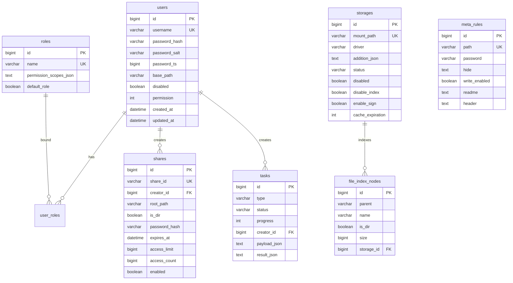

# AsukaFileList 详细设计

## 1. 技术栈建议

| 层级 | 技术选择 | 说明 |
| --- | --- | --- |
| Java 主服务 | Spring Boot 3, Java 21 | 主业务服务，提供 REST API 和协议适配 |
| ORM | Spring Data JPA 或 MyBatis Plus | 存储用户、权限、存储、分享、任务等元数据 |
| 数据库 | MySQL 8 | 主服务业务库，和 `.env.example` 中 `cloud_disk` 保持一致 |
| 缓存/任务 | Redis | 缓存、锁、任务状态；后续可配合 Redisson |
| Python AI 服务 | FastAPI, Celery | 当前已有 `ai-service` 雏形 |
| 向量库 | PostgreSQL + pgvector | 当前 `VectorDoc` 已基于 pgvector |
| 文档解析 | pypdf, python-docx, openpyxl | 当前 AI 服务已引入部分解析库 |

## 2. Java 包结构设计

```text
com.asuka.filelist
  api
    controller
    request
    response
  application
    auth
    fs
    storage
    share
    task
    ai
  domain
    user
    role
    storage
    fs
    share
    task
    meta
  infrastructure
    persistence
    cache
    driver
    security
    protocol
    client
  common
    exception
    path
    result
    util
```

分层原则：

- `api` 只处理 HTTP 入参、出参和状态码。
- `application` 编排用例，例如文件列表、上传、分享、触发索引。
- `domain` 定义核心模型和业务规则。
- `infrastructure` 实现数据库、缓存、驱动、AI HTTP 客户端等外部依赖。
- `common` 放路径规范化、异常、统一响应等基础工具。

## 3. 核心领域模型

### 3.1 User

参考 `ref/alist/internal/model/user.go`。

| 字段 | 类型 | 说明 |
| --- | --- | --- |
| id | Long | 主键 |
| username | String | 唯一用户名 |
| passwordHash | String | 密码哈希 |
| passwordSalt | String | 盐 |
| passwordTimestamp | Long | 密码变更时间，用于 JWT 失效 |
| basePath | String | 用户可见根路径 |
| roleIds | JSON/关联表 | 用户角色 |
| disabled | Boolean | 是否禁用 |
| permission | Integer | 兼容 AList 权限位，可逐步迁移到角色路径权限 |
| otpSecret | String | 二次验证预留 |

权限位建议与 AList 对齐：

| bit | 权限 |
| --- | --- |
| 0 | 查看隐藏文件 |
| 1 | 免目录密码访问 |
| 2 | 添加离线下载 |
| 3 | 新建目录/上传 |
| 4 | 重命名 |
| 5 | 移动 |
| 6 | 复制 |
| 7 | 删除 |
| 8 | WebDAV 读 |
| 9 | WebDAV 写 |
| 10 | FTP/SFTP 读 |
| 11 | FTP/SFTP 写 |
| 12 | 读压缩包 |
| 13 | 解压 |
| 14 | 路径限制 |
| 15 | MCP 读，预留 |
| 16 | MCP 写，预留 |

### 3.2 Role

参考 `ref/alist/internal/model/role.go` 和 `server/common/role_perm.go`。

```java
class Role {
    Long id;
    String name;
    String description;
    Boolean defaultRole;
    List<PermissionScope> permissionScopes;
}

class PermissionScope {
    String path;
    Integer permission;
}
```

角色校验规则：

- 如果请求路径等于用户 `basePath` 或 `/`，合并用户所有角色权限。
- 如果请求路径在某个 `PermissionScope.path` 下，则合并该 scope 的权限。
- 当用户启用路径限制时，请求路径必须落在角色授权路径内。

### 3.3 Storage

参考 `ref/alist/internal/model/storage.go`。

| 字段 | 类型 | 说明 |
| --- | --- | --- |
| id | Long | 主键 |
| mountPath | String | 挂载路径，唯一，必须规范化 |
| orderNo | Integer | 排序 |
| driver | String | 驱动名称 |
| cacheExpiration | Integer | 列表缓存分钟数 |
| status | String | work / disabled / init error |
| addition | JSON | 驱动私有配置 |
| remark | String | 备注，可用于引用驱动 |
| disabled | Boolean | 是否禁用 |
| disableIndex | Boolean | 是否禁用索引 |
| enableSign | Boolean | 是否强制下载签名 |
| orderBy | String | name / size / modified |
| orderDirection | String | asc / desc |
| extractFolder | String | folder 排序策略 |
| webProxy | Boolean | 下载代理 |
| webdavPolicy | String | WebDAV 下载策略 |
| proxyRange | Boolean | 是否代理 Range |

### 3.4 FileObject

参考 `ref/alist/internal/model/obj.go` 和 `object.go`。

```java
interface FileObject {
    String id();
    String path();
    String name();
    long size();
    Instant modifiedAt();
    Instant createdAt();
    boolean directory();
    Map<String, String> hashInfo();
}
```

下载链接模型：

```java
class FileLink {
    URI url;
    Map<String, String> headers;
    Duration expiration;
    boolean ipCacheKey;
    Integer concurrency;
    Integer partSize;
    InputStream stream;
}
```

### 3.5 MetaRule

参考 `ref/alist/internal/model/meta.go`。

| 字段 | 说明 |
| --- | --- |
| path | 生效路径 |
| password | 目录密码 |
| pSub | 密码对子目录生效 |
| write | 目录允许写 |
| wSub | 写权限对子目录生效 |
| hide | 隐藏规则，按行存储正则 |
| hSub | 隐藏规则对子目录生效 |
| readme/header | 目录说明和顶部内容 |

### 3.6 Share

参考 `ref/alist/internal/model/share.go`。

| 字段 | 说明 |
| --- | --- |
| shareId | 公开链接 ID |
| creatorId | 创建者 |
| name | 分享名 |
| rootPath | 分享根路径 |
| isDir | 是否目录 |
| passwordHash/passwordSalt | 分享密码 |
| burnAfterRead | 一次性访问 |
| accessLimit/accessCount | 访问次数限制 |
| allowPreview/allowDownload | 预览/下载控制 |
| enabled | 是否启用 |
| expiresAt | 过期时间 |

## 4. 驱动 SPI 设计

AList 的核心价值在于驱动插件化。Java 侧建议拆成基础接口和可选能力接口。

```java
public interface StorageDriver extends DriverMeta, DriverReader {
}

public interface DriverMeta {
    DriverConfig config();
    Storage storage();
    void setStorage(Storage storage);
    Object addition();
    void init(DriverContext context);
    void drop(DriverContext context);
}

public interface DriverReader {
    List<FileObject> list(DriverContext context, FileObject dir, ListArgs args);
    FileLink link(DriverContext context, FileObject file, LinkArgs args);
}

public interface DriverGetter {
    FileObject get(DriverContext context, String actualPath);
}

public interface DriverRootProvider {
    FileObject getRoot(DriverContext context);
}

public interface DriverWriter {
    void mkdir(DriverContext context, FileObject parentDir, String dirName);
    void move(DriverContext context, FileObject srcObj, FileObject dstDir);
    void rename(DriverContext context, FileObject srcObj, String newName);
    void copy(DriverContext context, FileObject srcObj, FileObject dstDir);
    void remove(DriverContext context, FileObject obj);
    FileObject put(DriverContext context, FileObject dstDir, UploadFile file, ProgressListener progress);
}

public interface DriverOtherAction {
    Object other(DriverContext context, OtherArgs args);
}
```

驱动注册方式：

- 第一阶段：Spring Bean 注册，`Map<String, StorageDriverFactory>` 管理驱动。
- 第二阶段：支持 Java `ServiceLoader`，驱动可独立模块化。
- 驱动名称和配置项通过 `DriverInfo` 暴露给管理端。

## 5. 挂载路径解析

参考 `ref/alist/internal/op/path.go`。

路径解析算法：

1. 对用户请求路径执行 `fixAndCleanPath`，统一前导 `/`，去除 `..`、重复 `/`。
2. 在内存挂载表中按“最长 mountPath 前缀”匹配存储。
3. 若匹配不到且路径为 `/`，返回虚拟根目录。
4. `actualPath = requestPath - mountPath`，传给驱动。
5. 驱动内部再结合自己的 root path/root id 访问真实存储。

伪代码：

```java
ResolvedPath resolve(String rawPath) {
    String path = PathUtil.fixAndClean(rawPath);
    StorageRuntime storage = mountedStorageRegistry.matchLongestPrefix(path);
    if (storage == null) {
        throw new StorageNotFoundException(path);
    }
    String actualPath = PathUtil.removePrefix(path, storage.mountPath());
    return new ResolvedPath(storage, PathUtil.fixAndClean(actualPath));
}
```

## 6. 文件系统服务设计

### 6.1 list

对应 AList：`server/handles/fsread.go -> internal/fs/list.go -> internal/op/fs.go`。

处理步骤：

1. Controller 绑定 `path/password/refresh/page/perPage`。
2. 当前用户执行 `joinPath(basePath, requestPath)`。
3. 查询最近的 `MetaRule`。
4. 校验角色可读、目录密码、隐藏规则。
5. `FsService.list(reqPath, refresh)`。
6. `StorageResolver.resolve(reqPath)` 得到驱动和 actualPath。
7. 使用缓存或调用 `driver.list`。
8. 应用排序、目录优先、隐藏过滤、分页。
9. 为需要签名的文件生成下载 sign。
10. 返回 `FsListResp`。

响应结构：

```json
{
  "content": [
    {
      "id": "driver-object-id",
      "path": "/docs/a.pdf",
      "name": "a.pdf",
      "size": 1024,
      "isDir": false,
      "modified": "2026-05-29T10:00:00Z",
      "sign": "download-sign",
      "thumb": "",
      "type": 4,
      "hashInfo": {}
    }
  ],
  "total": 1,
  "page": 1,
  "perPage": 200,
  "hasMore": false,
  "readme": "",
  "header": "",
  "write": true,
  "provider": "Local"
}
```

### 6.2 get

处理步骤：

1. 规范化路径。
2. 如果是 `/`，返回虚拟根目录。
3. 解析 storage + actualPath。
4. 优先使用 `DriverGetter.get`。
5. 若驱动不支持 get，则 list 父目录并按 name 匹配。

### 6.3 link/download

对应 AList：`internal/fs/link.go`, `internal/op/fs.go`, `server/middlewares/down.go`。

处理步骤：

1. 下载路径必须验证 sign，除非目录不要求签名。
2. `FsService.link(path, LinkArgs)` 获取 `FileLink`。
3. 如果 `FileLink.url` 为外部 URL，根据策略 302 跳转或代理。
4. 如果 `FileLink.stream` 存在，Java 直接流式写响应。
5. 支持 Range 请求，优先让驱动处理 Range；否则用代理流裁剪。
6. 对带 expiration 的链接做短期缓存。

### 6.4 upload

对应 AList：`server/handles/fsup.go`, `server/handles/fsup.go`, `internal/fs/put.go`。

处理步骤：

1. 从 header 或 multipart 读取 `File-Path`、`Overwrite`、`As-Task`。
2. 校验用户路径、目录 meta 密码、写权限。
3. 如 `Overwrite=false`，先检查目标是否存在。
4. 构造 `UploadFile`，包含名称、大小、MIME、hash、InputStream。
5. 小文件直接调用 `driver.put`。
6. 大文件或用户指定 `As-Task=true` 时创建上传任务。
7. 上传成功后发布 `FileChangedEvent`。
8. `AiIndexListener` 根据 MIME 和配置触发 Python AI 索引。

### 6.5 move/copy/rename/remove

第一阶段设计：

- 同存储内优先调用驱动原生能力。
- 跨存储 copy 使用 link + stream + put 组合，并作为异步任务执行。
- remove 成功后清理列表缓存、下载链接缓存、文件名索引和向量索引。
- rename/move 后需要更新路径相关索引。向量索引按 `userFileId` 绑定时不需要重建内容，只更新文件元数据；若只存 path，则必须重建索引。

## 7. 缓存设计

参考 `ref/alist/internal/op/fs.go`。

| 缓存 | key | value | 失效 |
| --- | --- | --- | --- |
| 挂载表 | mountPath | StorageRuntime | 存储启用、禁用、更新 |
| 列表缓存 | mountPath + actualPath | List<FileObject> | cacheExpiration、写操作、刷新 |
| 下载链接缓存 | mountPath + actualPath + ip? | FileLink | link.expiration |
| 角色缓存 | roleId | Role | 角色更新 |
| 设置缓存 | key | value | 设置更新 |

本地单机可用 Caffeine；多实例部署时挂载表仍在本机内存，配置变更通过 Redis Pub/Sub 广播清理缓存。

## 8. 数据库表设计

### 8.1 主服务 ER 图



### 8.2 AI 服务 vector_doc

当前模型在 `ai-service/app/models/vector_doc.py`。

| 字段 | 说明 |
| --- | --- |
| id | chunk 主键 |
| user_id | 用户 ID，用于权限隔离 |
| user_file_id | Java 主服务文件 ID 或索引文件 ID |
| chunk_index | 文件内 chunk 序号 |
| content | chunk 文本 |
| embedding | pgvector 向量 |
| created_at | 创建时间 |

建议后续补充：

- `storage_id`
- `path`
- `file_name`
- `mime_type`
- `content_hash`
- `updated_at`
- `deleted_at`
- `metadata JSONB`

## 9. Java REST API 设计

### 9.1 认证

| Method | Path | 说明 |
| --- | --- | --- |
| POST | `/api/auth/login` | 用户名密码登录 |
| GET | `/api/me` | 当前用户 |
| POST | `/api/me/update` | 更新当前用户 |
| GET | `/api/auth/logout` | 登出 |

### 9.2 文件系统

| Method | Path | 说明 |
| --- | --- | --- |
| POST | `/api/fs/list` | 文件列表 |
| POST | `/api/fs/get` | 文件详情 |
| POST | `/api/fs/dirs` | 仅列目录 |
| POST | `/api/fs/mkdir` | 新建目录 |
| POST | `/api/fs/rename` | 重命名 |
| POST | `/api/fs/move` | 移动 |
| POST | `/api/fs/copy` | 复制 |
| POST | `/api/fs/remove` | 删除 |
| PUT | `/api/fs/put` | 流式上传 |
| PUT | `/api/fs/form` | 表单上传 |
| POST | `/api/fs/search` | 文件名搜索 |
| GET | `/d/**` | 下载 |
| GET | `/p/**` | 代理下载 |

### 9.3 管理接口

| Method | Path | 说明 |
| --- | --- | --- |
| GET | `/api/admin/storage/list` | 存储列表 |
| POST | `/api/admin/storage/create` | 创建存储 |
| POST | `/api/admin/storage/update` | 更新存储 |
| POST | `/api/admin/storage/enable` | 启用存储 |
| POST | `/api/admin/storage/disable` | 禁用存储 |
| POST | `/api/admin/storage/delete` | 删除存储 |
| GET | `/api/admin/driver/list` | 驱动配置说明 |
| GET | `/api/admin/user/list` | 用户列表 |
| POST | `/api/admin/user/create` | 创建用户 |
| GET | `/api/admin/role/list` | 角色列表 |
| POST | `/api/admin/role/create` | 创建角色 |
| POST | `/api/admin/index/build` | 构建文件名索引 |

### 9.4 AI 代理接口

| Method | Path | 说明 |
| --- | --- | --- |
| POST | `/api/ai/index/file` | 手动触发单文件索引 |
| POST | `/api/ai/search/semantic` | 语义搜索 |
| POST | `/api/ai/search/hybrid` | 混合搜索 |
| POST | `/api/ai/chat` | RAG 流式问答 |
| GET | `/api/ai/tasks/{taskId}` | AI 索引任务状态 |

Java 代理层必须从登录态获取 `userId`，不要信任前端传入的 `userId`。

## 10. Python AI 服务接口契约

### 10.1 提交索引

当前接口：`POST /internal/index`。

请求：

```json
{
  "userFileId": 10001,
  "userId": 1,
  "fileDownloadUrl": "http://java-service/internal/files/10001/download?sign=xxx",
  "mimeType": "application/pdf"
}
```

响应：

```json
{
  "taskId": "celery-task-id"
}
```

### 10.2 语义搜索

当前接口：`POST /v1/search/semantic`。

请求：

```json
{
  "userId": 1,
  "query": "项目验收标准是什么",
  "limit": 10
}
```

响应：

```json
[
  {
    "userFileId": 10001,
    "chunkIndex": 0,
    "content": "相关文本片段",
    "score": 0.86
  }
]
```

### 10.3 RAG 问答

当前接口：`POST /v1/chat`，响应为 `text/event-stream`。

请求：

```json
{
  "userId": 1,
  "sessionId": 10,
  "question": "这份文档里有哪些风险？",
  "history": []
}
```

SSE 事件内容：

```text
data: {"type": "token", "content": "根据"}

data: {"type": "done"}
```

## 11. RAG 索引详细流程

当前 `ai-service/app/services/index_service.py` 流程：

1. `_download_file(fileDownloadUrl)` 使用 `master_token` 从 Java 下载文件。
2. `_extract_text(data, mimeType)` 按 MIME 提取文本。
3. `_split_text(text, 512, 64)` 滑动窗口切分。
4. `get_embeddings_batch(chunks)` 串行调用 Embedding API。
5. 删除旧 `VectorDoc`。
6. 批量写入新的 `VectorDoc`。

建议增强：

- 增加 `content_hash`，文件未变化时跳过重建。
- 增加解析器注册表，支持 `txt/md/pdf/docx/xlsx/html/csv`。
- Embedding 批处理改为真正批量请求，并增加速率限制。
- 搜索时做权限二次过滤：Java 代理搜索结果时根据 `userFileId/path` 再校验访问权限。
- RAG 返回引用来源：`fileName/path/chunkIndex/score`。

## 12. 事件与任务设计

事件类型：

| 事件 | 触发时机 | 消费者 |
| --- | --- | --- |
| FileCreated | 上传成功、离线下载完成 | 文件名索引、AI 索引 |
| FileUpdated | 覆盖上传、重命名 | 文件名索引、AI 索引 |
| FileMoved | 移动 | 文件名索引、AI 元数据更新 |
| FileDeleted | 删除 | 文件名索引删除、AI 向量删除 |
| StorageLoaded | 存储启用或加载 | 缓存刷新 |
| StorageDisabled | 存储禁用 | 挂载表移除、缓存删除 |

任务状态：

| 状态 | 说明 |
| --- | --- |
| PENDING | 已创建，等待执行 |
| RUNNING | 执行中 |
| SUCCESS | 成功 |
| FAILED | 失败 |
| CANCELED | 已取消 |
| RETRYING | 等待重试 |

## 13. 异常与响应规范

统一响应：

```json
{
  "code": 200,
  "message": "success",
  "data": {}
}
```

核心异常：

| 异常 | HTTP | 说明 |
| --- | --- | --- |
| UnauthorizedException | 401 | 未登录或 token 无效 |
| PermissionDeniedException | 403 | 无权限 |
| StorageNotFoundException | 404 | 无匹配挂载存储 |
| ObjectNotFoundException | 404 | 文件不存在 |
| NotFolderException | 400 | 目标不是目录 |
| NotFileException | 400 | 目标不是文件 |
| DriverNotSupportedException | 405 | 驱动不支持该操作 |
| StorageInitException | 500 | 存储初始化失败 |
| AiServiceException | 502 | AI 服务调用失败 |

## 14. 配置项

Java 主服务：

```yaml
asuka:
  jwt-secret: ${JWT_SECRET}
  token-expires-hours: 48
  ai:
    base-url: http://localhost:8000
    api-key: ${AI_SERVICE_KEY}
    internal-download-token: ${MASTER_TOKEN}
  storage:
    list-cache-enabled: true
    link-cache-enabled: true
  upload:
    max-size: 10GB
    task-threshold: 100MB
```

Python AI 服务当前配置见 `ai-service/app/core/config.py`：

- `api_key`
- `deepseek_api_key`
- `deepseek_base_url`
- `deepseek_embed_model`
- `deepseek_chat_model`
- `embed_dim`
- `postgres_dsn`
- `redis_url`
- `master_url`
- `master_token`

## 15. 第一阶段实现清单

1. 初始化 Spring Boot 工程、统一响应和异常处理。
2. 建立用户、角色、存储、meta、任务基础表。
3. 实现路径工具：`fixAndCleanPath`、`joinBasePath`、`isSubPath`。
4. 实现驱动 SPI 和 `LocalDriver`。
5. 实现 `MountedStorageRegistry` 和最长前缀匹配。
6. 实现 `/api/fs/list`、`/api/fs/get`、`/d/**` 下载。
7. 实现管理员存储管理接口。
8. 实现 AI 客户端和 `/api/ai/search/*`、`/api/ai/chat` 代理。
9. 上传成功后调用 `POST /internal/index`。
10. 增加基础集成测试：LocalDriver、路径越权、list/get/download、AI 客户端 mock。

