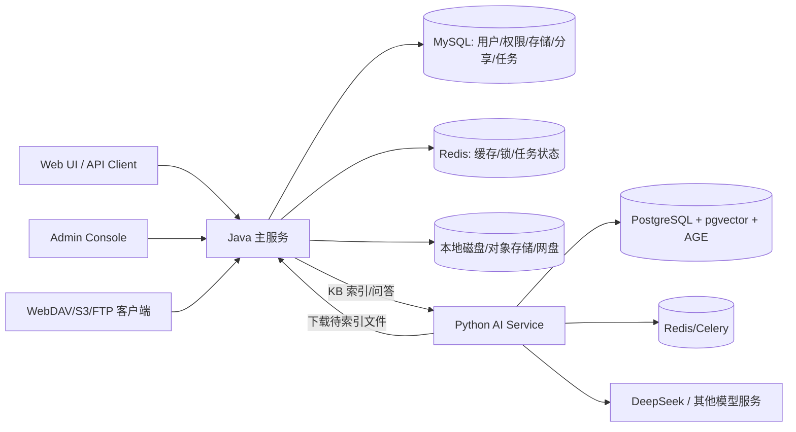
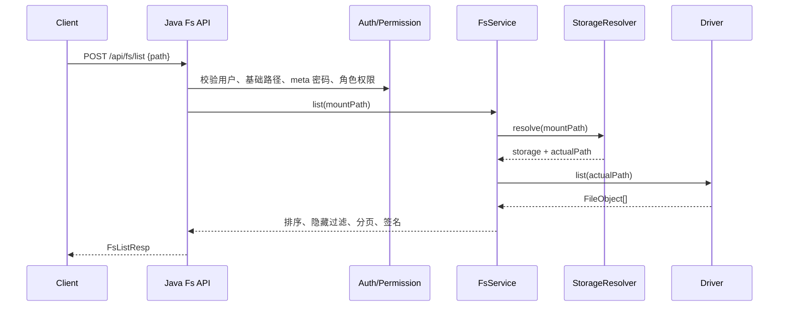
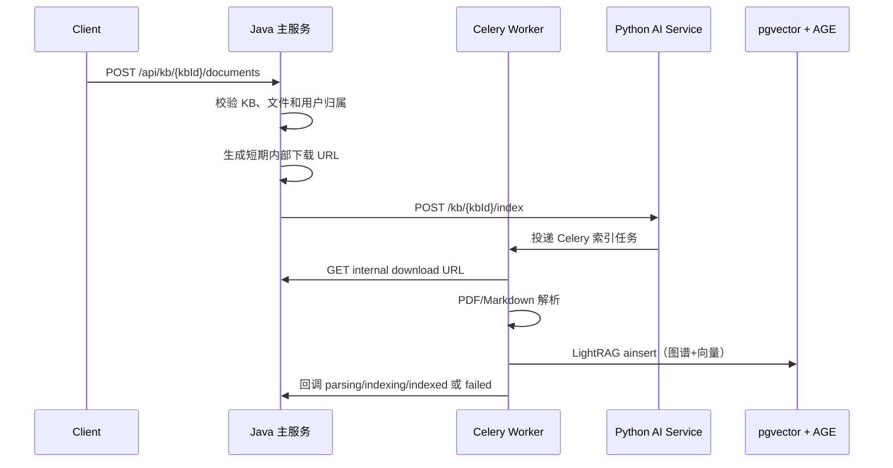
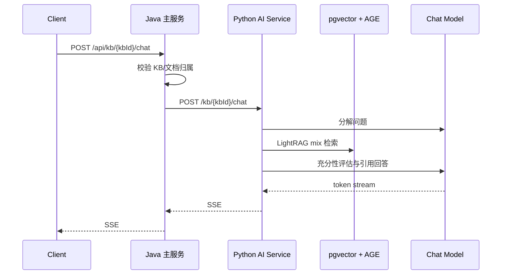

# AsukaFileList 概要设计

## 1. 背景与目标

AsukaFileList 目标是逐步搭建一个 Java 版本的 AList，并在文件管理能力之上接入 Python RAG 服务，形成“网盘文件列表 + 语义搜索 + 智能知识库问答”的一体化产品。

产品分为两个核心服务：

- Java 主服务：负责用户、权限、存储挂载、统一文件系统、下载/上传、分享、任务、管理后台接口等 AList 核心能力。
- Python AI 服务：负责 PDF/Markdown 解析、LightRAG 图谱与向量索引、Agentic RAG
  检索和知识库流式问答。

本设计以 `ref/alist` 的源码为主要参考，尤其参考其驱动抽象、挂载路径解析、文件系统编排、权限校验和索引构建机制。

## 2. AList 源码参考结论

| 设计主题 | AList 参考源码 | 可借鉴点 |
| --- | --- | --- |
| HTTP 路由分层 | `ref/alist/server/router.go` | 将公共接口、登录接口、文件系统接口、管理接口、分享接口、任务接口分组管理 |
| 驱动 SPI | `ref/alist/internal/driver/driver.go` | Driver 由 Meta、Reader 组成，写操作、归档、Other 能力用可选接口扩展 |
| 驱动配置描述 | `ref/alist/internal/driver/config.go`, `item.go` | 每个驱动声明名称、是否支持上传、是否本地排序、配置项定义 |
| 存储挂载管理 | `ref/alist/internal/op/storage.go` | 存储配置入库后实例化驱动，初始化成功后维护内存挂载表 |
| 挂载路径解析 | `ref/alist/internal/op/path.go` | 用户请求路径按挂载点匹配为 storage + actualPath |
| 文件系统编排 | `ref/alist/internal/fs/*.go`, `ref/alist/internal/op/fs.go` | fs 层接收挂载路径，op 层调用实际驱动，并统一处理缓存、排序、链接缓存 |
| 文件对象模型 | `ref/alist/internal/model/obj.go`, `object.go`, `args.go` | 统一 Obj、Link、FileStreamer，屏蔽不同云盘差异 |
| 权限模型 | `ref/alist/internal/model/user.go`, `role.go`, `server/common/role_perm.go` | 用户基础路径、角色路径授权、权限位组合、隐藏文件和密码目录 |
| 索引构建 | `ref/alist/internal/search/*.go` | 遍历文件树、批量写入搜索索引、支持重建/更新/停止/进度 |
| 分享模型 | `ref/alist/internal/model/share.go`, `server/handles/share*.go` | 分享链接、密码、过期时间、访问次数、预览/下载控制 |

## 3. 系统边界

### 3.1 Java 主服务职责

- 用户认证：登录、JWT、会话、管理员 token、访客。
- 权限控制：基于用户基础路径、角色路径权限、目录 meta 规则进行访问判断。
- 存储管理：创建、更新、启用、禁用、删除挂载存储。
- 驱动体系：用 Java SPI/接口实现 Local、S3、WebDAV、AList 远程、阿里云盘等驱动的渐进扩展。
- 统一文件系统：提供 list、get、mkdir、rename、move、copy、remove、upload、link/download。
- 分享能力：公开分享、密码校验、过期、访问次数、下载限制。
- 任务中心：上传、复制、离线下载、索引等耗时任务的异步调度和进度查询。
- AI 服务协作：用户把文件加入知识库后触发索引任务，向 Python 服务提供内部下载 URL。

### 3.2 Python AI 服务职责

当前 `ai-service` 提供：

- FastAPI 服务入口：`ai-service/app/main.py`
- 知识库增量索引：`POST /kb/{kbId}/index`
- 知识库/文档删除：`DELETE /kb/{kbId}`、`DELETE /kb/{kbId}/doc/{docId}`
- Agentic RAG 问答：`POST /kb/{kbId}/chat`，SSE 流式输出
- Celery 异步解析与索引任务，同一知识库通过 Redis 锁串行化
- LightRAG 使用 PostgreSQL + pgvector + Apache AGE 存储 KV、向量、图和文档状态
- 本地 bge-m3 Embedding 与 DeepSeek Chat

AI 服务不直接管理用户文件系统，只通过 Java 主服务授权的内部下载 URL 拉取文件内容。

## 4. 总体架构

## 5. 核心模块划分

### 5.1 Java 主服务模块

| 模块 | 职责 |
| --- | --- |
| auth | 登录、JWT、会话、密码、管理员 token、访客鉴权 |
| user-role | 用户、角色、权限位、路径权限范围 |
| storage | 存储挂载配置、驱动初始化、挂载表维护 |
| driver-spi | 驱动接口、驱动配置描述、可选能力接口 |
| fs | 统一文件系统应用服务，完成路径解析、权限检查、缓存、排序和驱动调用 |
| share | 分享链接、访问令牌、过期和访问限制 |
| task | 异步任务、进度、取消、失败重试 |
| search-index | 文件名索引 |
| ai-client | 调用 Python AI 服务的内部客户端 |
| kb | 知识库、文档归属、索引状态和问答代理 |
| protocol | HTTP 下载、WebDAV、S3 兼容协议，后续再扩展 FTP/SFTP |
| admin-api | 管理存储、驱动、用户、角色、设置、索引、任务 |

### 5.2 Python AI 服务模块

| 模块 | 当前代码 | 职责 |
| --- | --- | --- |
| api | `ai-service/app/api/kb_router.py` | 内网 KB 索引、删除、问答和任务状态接口 |
| parse | `services/parse_service.py` | 下载 PDF/Markdown，并统一转换为 Markdown |
| lightrag | `services/lightrag_service.py` | workspace 实例、PG 存储、增量插入与删除 |
| embedding | `services/embedding_service.py` | 本地 bge-m3 加载、GPU/CPU 选择 |
| agent | `services/agent_service.py` | 查询分解、检索、充分性评估、引用与流式回答 |
| task | `tasks/kb_index_tasks.py` | Celery KB 索引任务、Redis 串行锁、状态回调 |

## 6. 关键业务流程

### 6.1 文件列表

### 6.2 文件加入知识库后触发索引

### 6.3 知识库问答

## 7. 数据存储规划

- MySQL：Java 主服务业务数据，包括用户、角色、存储、meta、分享、任务、文件索引元数据。
- Redis：任务队列、短期缓存、分布式锁、会话刷新缓存。
- PostgreSQL + pgvector + Apache AGE：LightRAG 的 KV、向量、图谱和文档状态。
- 对象/网盘存储：真实文件内容，由各驱动访问。

## 8. 安全设计原则

- 外部用户只访问 Java 主服务；Python AI 服务默认只暴露 Compose 内网，并使用
  `X-API-Key` 鉴权。
- Java 生成内部下载 URL 时必须带短期签名或内部 token。
- Python AI 服务请求 Java 下载文件时使用 `Authorization: Bearer <master_token>`。
- 用户路径必须先经过 `basePath` 拼接和规范化，避免越权访问挂载根以外路径。
- 分享访问令牌和下载签名分离，避免公开分享获得主站登录能力。
